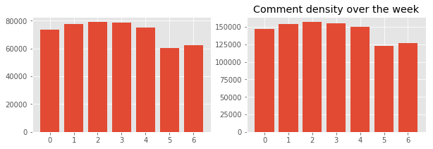

## A solid attempt at cracking the age old question on the internet: "Are they being serious??"
### Problem Statement
As technology rapidly expands to encompass a large portion of our social interaction, some of its glaring setbacks have begun to show themselves. Namely, in this project, the difficulty of determining whether or not a random comment was completely serious or made in jest. This is not just a machine learning problem; we humans have a lot of difficulty distinguishing sarcasm without certain indicators. A common solution to this problem is the growing popularity of the "/s" tag, placed at the end of a comment to indicate that it was sarcastic in nature and mimicing html tags to show that the sarcasm is now over.  
We have obtained a [large dataset](https://www.kaggle.com/danofer/sarcasm) (about a million comments) over the last 9 years from reddit.com, a news and topic aggregator that is currently (as of 2019) the 5th most popular website in the United States, and 15th in the world. As a balanced dataset, it contains an even splits of comments tagged with the "/s" tag and without. There is an important distinction here: the tags are added by the author of the comment, and is not universally accepted, meaning that there will be "dirty data" in the form of sarcastic comments not tagged. There is also a consideration in cleaning up mispellings - elongating words as a popular way to indicate sarcasm, for example.
### EDA
First, we performed some basic EDA to attempt to suss out any correlations that we would like to know before training our model. Firstly, keeping in mind reddits rise in popularity, we looked to see if the increase in comments over time was proportional to the number of votes over time.  
  
Clearly not: the proportion of votes to comments increases drastically. This does allow us to use both date and votes in our training data, as they are not strictly colinear.  
  
We examine if the ratio of sarcastic comments to not changes across the week (0 is Monday); it does not.  
  
There does seem to be somewhat of a difference in comment length when comparing the two, however.  
### SVD
Next, we attempt to reduce some of the hundreds of thousands of dimensions in our data with Truncated SVD. This is roughly comparable to PCA, however, because of the massive amounts of memory that our columns are taking up, we would rather feed a sparse matrix directly into our transformer, instead of densifying them and increasing the memory load. Despite this, there is a very small signal to be seen in the data, with the first component only explaining .24% of the variance and decreasing from there.  
  
There's not much I can say about the topics apart from just showing them here.  

### Modeling
Initially, we started out building our models with a simple bag-of-words (BOW) approach. Unfortunately, this only results in 55-56% accuracy (especially bad considering that our data was balanced). The most successful models came from the Doc2Vec library - an alternative to BOW that vectorizes each word in relation to each other with respect to their definitions, regardless of document length.  
  
It also uses the "Skip-Gram" method - instead of predicting one word at a time, we use one word to predict the surrounding words, or context. This is a *much* slower technique, but considerably more accurate with infrequent words.  
This model achieved between 62-64%(!) accuracy.
### Future possibilities
There are a number of ways this project can diverge from here - apart from classifying text, we can use a modified model to attempt to build a sarcastic comment from a seed, or even attempt to de-sarcasticafy statements. Another option would be to explore the possibility of a continuous variable representing sarcasm - sometimes people are only half serious about topics. At any rate, it would certainly be interesting to test this model against human participation and see who comes out on top.
